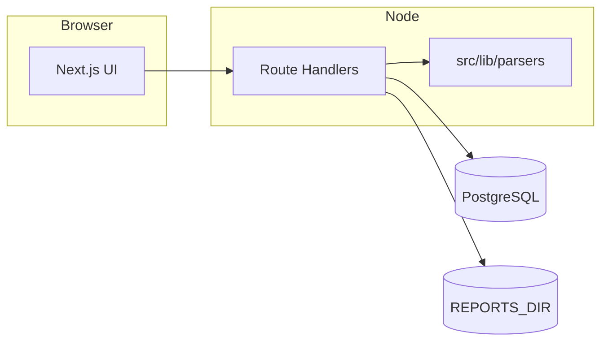

<div align="center">

# Procyon

**A lightweight, self-hosted vulnerability tracking workspace.**

Kanban board, retro-planning, and extensible scan imports — without the bloat.

[](https://nextjs.org/)
[](https://www.typescriptlang.org/)
[](https://www.prisma.io/)
[](LICENSE)

[Features](#-features) · [Quick start](#-quick-start) · [Docker](#-docker) · [API](#-api) · [Contributing](#-contributing)

</div>

---

## Why Procyon?

Security teams juggle spreadsheets, heavy GRC suites, and one-off exports. **Procyon** sits in the middle: a **fast** web UI to triage findings, acknowledge alerts, set due dates, and **replay imports** from familiar tools (PingCastle, CSV, and more via pluggable parsers).

- **Own your data** — PostgreSQL + optional on-disk archive of imported files.
- **Opinionated UX** — severity on the card edge, drag-and-drop status on the dashboard, planning views when you need the big picture.
- **Small surface** — Next.js App Router, a focused REST API, no unnecessary services.

---

## Features

| Area | What you get |
|------|----------------|
| **Dashboard** | Three-column board (To do / In progress / Done). Drag cards by the handle to change status. Manual create + inline acknowledge workflow. |
| **Planning** | Bucketed deadlines, 14-day timeline, Kanban by status, Gantt-style creation → due date. Filters for done items and unacknowledged only. |
| **Imports** | Upload scan output against a **scan template** (slug + parser). Re-imports with the same `externalRef` update the existing row. |
| **Reports archive** | Successful imports store a copy under `REPORTS_DIR`; browse and download from the UI. |
| **Theming** | Light, dark, or system — from the settings menu. |

---

## Tech stack

| Layer | Choice |
|-------|--------|
| Framework | [Next.js 15](https://nextjs.org/) (App Router), [React 19](https://react.dev/) |
| Language | [TypeScript](https://www.typescriptlang.org/) |
| Styling | [Tailwind CSS v4](https://tailwindcss.com/) |
| Database | [PostgreSQL](https://www.postgresql.org/) via [Prisma](https://www.prisma.io/) |
| Drag & drop | [@dnd-kit/core](https://docs.dndkit.com/) |
| XML / CSV | [fast-xml-parser](https://github.com/NaturalIntelligence/fast-xml-parser) + custom parsers |



---

## Quick start

### Prerequisites

- **Node.js** 20+ (recommended)
- **PostgreSQL** 14+ (or use Docker Compose below)

### 1. Clone and install

```bash
git clone https://github.com/QuentinHelion/Procyon
cd procyon
npm install
```

### 2. Environment

```bash
cp .env.example .env
```

Edit `.env`:

| Variable | Purpose |
|----------|---------|
| `DATABASE_URL` | PostgreSQL connection string |
| `REPORTS_DIR` | Directory for archived import files (absolute or relative to cwd) |

### 3. Database

```bash
npx prisma migrate deploy
npx prisma db seed
```

The seed loads built-in scan templates (e.g. PingCastle XML, generic CSV).

### 4. Run

```bash
npm run dev
```

Open **[http://localhost:3000](http://localhost:3000)**.

### Useful scripts

| Command | Description |
|---------|-------------|
| `npm run dev` | Development server (Turbopack) |
| `npm run build` | Production build (`prisma generate` + `next build`) |
| `npm run start` | Start production server |
| `npm run lint` | ESLint |
| `npm run db:studio` | Prisma Studio |

---

## Docker

Run the full stack (app + Postgres) with persisted DB and report volumes:

```bash
docker compose up --build
```

- **App:** [http://localhost:3000](http://localhost:3000)
- Migrations and seed run on container startup.
- Volumes: `procyon_pg` (database), `procyon_reports` (archived files at `REPORTS_DIR=/app/data/reports`).

---

## Project structure

```
procyon/
├── prisma/                 # Schema, migrations, seed
├── src/
│   ├── app/                # App Router pages & API routes
│   ├── components/         # React UI (Dashboard, Planning, Reports, …)
│   └── lib/
│       ├── parsers/        # Scan parsers + registry
│       ├── planning-buckets.ts
│       ├── gantt.ts
│       └── db.ts
├── docker-compose.yml
├── Dockerfile
└── README.md
```

---

## Scan templates & parsers

Built-in templates (see seed) map a **slug** to a **`parserId`** implemented in code.

| Parser ID | Typical input |
|-----------|----------------|
| `pingcastle_xml` | PingCastle XML exports (flexible risk-rule node detection) |
| `generic_csv` | CSV with header: `title`, `severity`, optional `description`, `externalRef`. Severities: `INFO`, `LOW`, `MEDIUM`, `HIGH`, `CRITICAL`. |

From the UI you can register **new templates** that reuse an existing `parserId`.

### Adding a new tool (developers)

1. Implement a parser in `src/lib/parsers/` returning `ParseResult`.
2. Register it in `src/lib/parsers/index.ts` (`runParser`).
3. Add the id in `src/lib/parser-ids.ts` (`PARSER_IDS`).
4. Seed or create a `ScanTemplate` row pointing at that `parserId`.

---

## API

REST-style handlers under `src/app/api/`.

| Method | Path | Description |
|--------|------|-------------|
| `GET`, `POST` | `/api/vulnerabilities` | List / create vulnerabilities |
| `PATCH`, `DELETE` | `/api/vulnerabilities/[id]` | Update fields (status, `dueAt`, `acknowledgedAt`, …) / delete |
| `GET`, `POST` | `/api/templates` | List / create scan templates |
| `POST` | `/api/import` | `multipart/form-data`: `file`, `templateSlug` |
| `GET` | `/api/reports` | List import batches + file presence |
| `GET` | `/api/reports/[id]/file` | Stream archived file (`?download=1` to force download) |

Imports that supply `externalRef` **upsert** by that reference when a row already exists.

---

## Data model (high level)

- **`Vulnerability`** — title, description, severity, status, source, optional `externalRef`, `dueAt`, `acknowledgedAt`, JSON `metadata`.
- **`ScanTemplate`** — display name, slug, `parserId`, file hint.
- **`ImportBatch`** — links uploads to a template; optional `storedPath` under `REPORTS_DIR`.

Acknowledgement (`acknowledgedAt`) is independent of status **Done** — use both for compliance-style workflows.

---

## Contributing

Contributions are welcome.

1. **Fork** the repository and create a branch from `main`.
2. **Keep changes focused** — one concern per PR when possible.
3. Run **`npm run lint`** before opening a PR.
4. For parsers or schema changes, include **migrations** and update this README if behavior or env vars change.

Please open an issue first for large features so we can align on direction.

---

## Security

If you discover a security issue, please **do not** file a public issue. Contact the maintainers privately with reproduction steps and impact. We will coordinate disclosure.

---

## License

Procyon is released under the **Apache License 2.0**. See [LICENSE](LICENSE).
